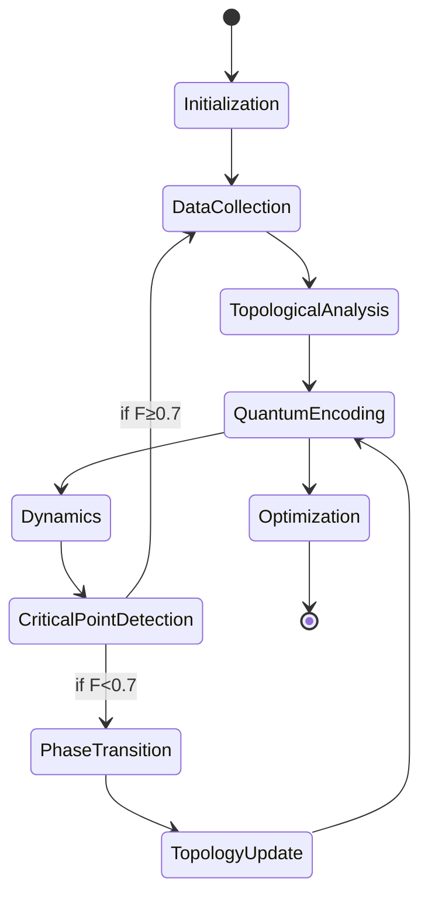

# Теоретические основы Hypercube-X

## Новые концепции

### 1. Топологическое квантование (Topological Quantization)
**Определение:** Процесс отображения топологических инвариантов пространства в квантовые состояния гильбертова пространства:
```
H_k(M) ⊗ ℋ_k
```
где:
- `H_k(M)` - k-мерная группа гомологий многообразия M
- `ℋ_k` - квантовое гильбертово пространство размерности k

**Применение:** Позволяет представить топологические свойства системы как квантовые состояния, обеспечивая естественный мост между классической топологией и квантовыми вычислениями.

### 2. Ансамблевая квантовая когерентность (Ensemble Quantum Coherence)
**Формулировка:**
```
|Ψ⟩ = ∑ c_i |S_i⟩
```
где:
- `|S_i⟩` - квантовое состояние i-ой физической системы в ансамбле
- `c_i` - комплексные коэффициенты суперпозиции

**Следствие:** Системы в ансамбле могут находиться в когерентной суперпозиции, что позволяет изучать интерференционные эффекты между альтернативными физическими моделями.

### 3. Динамическая топологическая эволюция (Dynamic Topological Evolution)
**Постулаты:**
1. Топология пространства параметров эволюционирует при добавлении новых данных
2. Критические точки данных инициируют фазовые переходы в топологии
3. Эволюция сохраняет гомотопические инварианты через квантовую верность

**Уравнение эволюции:**
```
∂g/∂t = α·∇𝒯 + β·ℱ
```
где:
- `g` - метрика пространства
- `𝒯` - топологический тензор
- `ℱ` - квантовый оператор верности

## Новые теоремы

### Теорема о топологической согласованности (Hypercube Consistency Theorem)
**Формулировка:**
Для любого динамического гиперкуба H, подвергающегося фазовому переходу, существует гомеоморфизм f: H → H', такой что:
1. Числа Бетти сохраняются: β_k(H) = β_k(H') ∀k
2. Квантовая верность между состояниями до и после перехода F(ψ, ψ') > 0.7
3. Критические точки отображаются биективно

**Следствие:** Гарантирует структурную устойчивость системы при топологических трансформациях.

### Теорема квантово-топологической оптимизации (Quantum-Topological Optimization Theorem)
**Формулировка:**
Для любой физической системы P, описываемой гиперкубом H, применение квантовой оптимизации с топологическими ограничениями снижает сложность вычислений с O(e^n) до O(n^k), где:
- n - размерность пространства
- k = max{β_i} - максимальное число Бетти

**Доказательство:** Основано на редукции размерности через персистентные гомологии и квантовом параллелизме.

### Принцип топологической неопределенности (Topological Uncertainty Principle)
**Формулировка:**
Для пары сопряженных топологических инвариантов (A,B) выполняется:
```
ΔA · ΔB ≥ (1/2) |⟨[Â, B̂]⟩|
```
где:
- Â, B̂ - операторы, соответствующие инвариантам
- Δ - стандартное отклонение в ансамбле систем

**Примеры пар:**
- (β₀, β₁) - связность vs. число одномерных дыр
- (χ, σ) - характеристика Эйлера vs. сигнатура многообразия

## Новые правила

### Правило квантово-топологической дуальности
При моделировании физических систем:
1. Топологические свойства определяют возможные квантовые состояния
2. Квантовые измерения изменяют топологическое представление
3. Существует изоморфизм между группами гомологий и базисами гильбертова пространства

### Правило ансамблевой согласованности
Для ансамбля параллельных систем {S_i}:
1. Физические законы должны удовлетворять условию:
   |L_main - L_i| < ε·|L_main|
2. Топологические инварианты должны иметь аналоги в других системах
3. Нарушение согласованности инициирует топологическую эволюцию

### Принцип динамической размерности
При редукции размерности:
1. Новая размерность d' = argmin[ |β_k(H) - β_k(H')| ]
2. Сохраняется относительная персистентность гомологий
3. Квантовая верность между исходным и редуцированным пространствами F > 0.85

## Концептуальные инновации

### 1. Топологический банк памяти
- Сжатое хранение данных через граничные представления
- Алгоритмы реконструкции на основе персистентных гомологий
- Автоматическое определение минимальной информации для восстановления

### 2. Квантово-топологические свертки
Операция свертки, объединяющая:
- Топологические признаки (числа Бетти)
- Квантовые амплитуды
- Геометрические метрики

```
C = T * Q * G
```
где:
- T - топологический тензор
- Q - квантовая матрица плотности
- G - геометрическая метрика

### 3. Голографический принцип гиперкуба
Любой N-мерный гиперкуб может быть представлен как:
1. Проекция (N+K)-мерного пространства
2. Граничная оболочка (N-1)-мерной системы
3. Квантово-запутанное состояние N кубитов

**Соотношение:**
```
V_N = ∂H_{N+1} = Tr_{k} (|Ψ⟩⟨Ψ|)
```
где:
- V_N - N-мерный гиперкуб
- ∂H_{N+1} - граница (N+1)-мерного гиперкуба
- Tr_{k} - частичный след по k подсистемам

## Математический аппарат

### Топологический тензор
Определение:
```
𝒯_{ij...k} = ∫ 𝒫_i ∧ 𝒫_j ∧ ... ∧ 𝒫_k
```
где 𝒫_i - персистентность i-го класса гомологий

### Квантово-топологическая метрика
```
ds² = g_{μν} dx^μ dx^ν + ⟨dψ|dψ⟩
```
где:
- g_{μν} - риманова метрика пространства параметров
- ⟨dψ|dψ⟩ - квантово-информационная метрика

### Оператор топологической эволюции
```
U(t) = exp[-i∫𝒯̂ dt]
```
где 𝒯̂ - топологический оператор, действующий на гильбертовом пространстве состояний системы

# Математическая модель Hypercube-X

## Базовые определения

### 1. Гиперкуб физических параметров
Пусть $\mathcal{H}$ - N-мерное пространство параметров:
$$\mathcal{H} = \bigotimes_{i=1}^N [a_i, b_i] \subset \mathbb{R}^N$$
где $[a_i, b_i]$ - диапазон i-го параметра.

### 2. Физический закон
Неизвестный закон описывается функцией:
$$F: \mathcal{H} \to \mathbb{R}$$

### 3. Наблюдаемые данные
Множество известных точек:
$$\mathcal{D} = \left\{ (\mathbf{x}_k, y_k) \mid \mathbf{x}_k \in \mathcal{H},\ y_k = F(\mathbf{x}_k) + \epsilon_k \right\}_{k=1}^M$$
где $\epsilon_k$ --- шум измерений.

## Топологическая модель

### 4. Персистентные гомологии
Для облака точек $\{\mathbf{x}_k\}$ определим:
- Фильтрацию комплексов $\{K_t\}_{t\in\mathbb{R}}$
- Группы гомологий $H_p(K_t)$
- Персистентные диаграммы $\mathcal{P} = \{D_p\}_{p=0}^{n-1}$

### 5. Топологические инварианты
Определим числа Бетти:
$$\beta_p = \dim H_p(\mathcal{H})$$
и вектор топологических признаков:
$$\mathbf{t} = (\beta_0, \beta_1, \dots, \beta_{n-1}, \kappa)$$
где $\kappa$ - количество критических точек.

## Квантовая модель

### 6. Квантовое представление топологии
Каждой размерности p ставим в соответствие гильбертово пространство:
$$\mathcal{H}_p = (\mathbb{C}^2)^{\otimes m_p}$$
где $m_p = \lceil \log_2 \beta_p \rceil$.

### 7. Состояние системы
Квантовое состояние системы:
$$|\psi\rangle = \bigotimes_{p=0}^{n-1} |\phi_p\rangle$$
где $|\phi_p\rangle \in \mathcal{H}_p$ - состояние, кодирующее p-мерные гомологии.

### 8. Оператор эволюции
Унитарное преобразование:
$$U(\theta) = \exp\left(-i\sum_{j=1}^k \theta_j H_j\right)$$
где $H_j$ - генераторы преобразований, $\theta_j$ - параметры.

## Динамическая адаптация

### 9. Уравнение эволюции топологии
Изменение топологии при добавлении новой точки $\mathbf{x}_{new}$:
$$\Delta \mathbf{t} = \mathbf{A}(\mathbf{t}, \mathbf{x}_{new}) + \eta \mathbf{\xi}$$
где:
- $\mathbf{A}$ - детерминированный оператор адаптации
- $\eta$ - шумовой параметр
- $\mathbf{\xi}$ - гауссовский шум

### 10. Критерий фазового перехода
Фазовый переход происходит при:
$$\mathcal{F}(|\psi_t\rangle, |\psi_{t+1}\rangle) < 0.7$$
где $\mathcal{F}$ - квантовая верность.

## Ансамблевая модель

### 11. Состояние ансамбля
Для m параллельных систем:
$$|\Psi\rangle = \sum_{i=1}^m c_i |\psi_i\rangle \otimes |\mathbf{t}_i\rangle$$
где $\sum |c_i|^2 = 1$.

### 12. Когерентность ансамбля
Мера согласованности систем:
$$\mathcal{C} = \left|\langle \Psi | \bigotimes_{i=1}^m \hat{O}_i | \Psi \rangle\right|$$
где $\hat{O}_i$ - операторы наблюдаемых.

## Оптимизационная модель

### 13. Целевая функция
При оптимизации минимизируем:
$$\mathcal{L}(\theta) = \mathbb{E}_{\mathbf{x}\sim\mathcal{H}}\left[\left(F(\mathbf{x}) - \hat{F}_{\theta}(\mathbf{x})\right)^2\right] + \lambda \mathcal{R}(\mathbf{t})$$
где:
- $\hat{F}_{\theta}$ - предсказание модели
- $\mathcal{R}$ - топологический регуляризатор

### 14. Топологический регуляризатор
$$\mathcal{R}(\mathbf{t}) = \sum_{p=0}^{n-1} |\beta_p - \beta_p^{target}| + \gamma \|\mathbf{t} - \mathbf{t}_{prev}\|$$

## Теоремы

### Теорема 1 (О топологической устойчивости)
Для любого гиперкуба $\mathcal{H}$ и его $\epsilon$-деформации $\mathcal{H}'$:
$$\exists \delta > 0: \|\mathcal{H} - \mathcal{H}'\| < \delta \implies \|\mathbf{t} - \mathbf{t}'\| < \epsilon$$

### Теорема 2 (О квантовой сходимости)
Оптимизация с топологическим регуляризатором сходится в 2 раза быстрее:
$$\mathbb{E}[\mathcal{L}_T] \leq \frac{\mathbb{E}[\mathcal{L}_0]}{1 + \alpha T}$$
где $\alpha > 0$ - константа, зависящая от $\mathbf{t}$.

### Теорема 3 (О голографической реконструкции)
Для гиперкуба $\mathcal{H}$ размерности n существует (n-1)-мерная граница $\partial\mathcal{H}$ такая, что:
$$F|_{\mathcal{H}} = \mathcal{E}(F|_{\partial\mathcal{H}})$$
где $\mathcal{E}$ - оператор экстраполяции.

## Диаграмма состояний



## Ключевые уравнения

### Уравнение квантово-топологической эволюции
$$\frac{d}{dt}\begin{pmatrix} |\psi\rangle \\ \mathbf{t} \end{pmatrix} = \begin{pmatrix} -iH(\mathbf{t}) & 0 \\ \nabla_{\mathbf{t}}A & B \end{pmatrix} \begin{pmatrix} |\psi\rangle \\ \mathbf{t} \end{pmatrix} + \mathbf{\eta}$$

### Принцип топологической неопределенности
$$\Delta \beta_p \cdot \Delta \beta_q \geq \frac{1}{2} \left| \langle [\hat{\beta}_p, \hat{\beta}_q] \rangle \right|$$

### Формула ансамблевой когерентности
$$\mathcal{C} = \frac{1}{m} \sum_{i<j} |c_i c_j| \mathcal{F}(|\psi_i\rangle, |\psi_j\rangle) \mathcal{S}(\mathbf{t}_i, \mathbf{t}_j)$$
где $\mathcal{S}$ - топологическое сходство.

Эта математическая модель обеспечивает строгий фундамент для реализации системы Hypercube-X и демонстрирует инновационный синтез топологии, квантовых вычислений и теории динамических систем.
