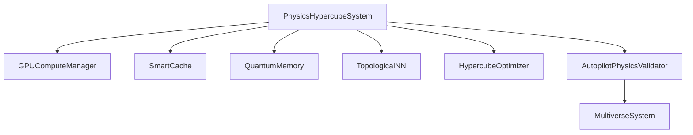
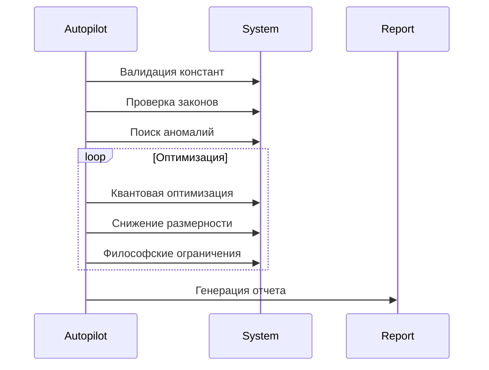
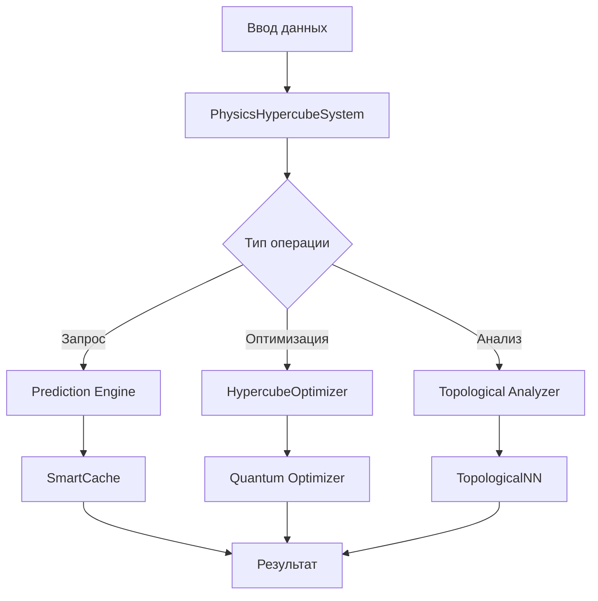

# Архитектура Physics Hypercube System (PHCS) v.3.0


## 🌌 Обзор системы
PHCS - это **гибридная вычислительная платформа** для моделирования многомерных физических систем. Архитектура сочетает:
- Квантово-классические вычисления
- Топологический анализ данных
- Философские ограничения
- Автоматическую валидацию законов

Система реализует концепцию **"голографического гиперкуба"**, где физические законы представлены как функции в n-мерном пространстве параметров.

## 🧩 Модульная архитектура



### 1. Ядро системы: PhysicsHypercubeSystem
**Ответственность**: Моделирование физических законов в n-мерном пространстве

**Ключевые компоненты**:
- **Dimensional Space Manager**
  - Хранение параметров измерений (непрерывные/категориальные)
  - Динамическое масштабирование пространства
- **Knowledge Base**
  - Хранение известных точек данных
  - Управление коллизионными линиями
- **Prediction Engine**
  - Гауссовские процессы (классические и квантовые)
  - Интерполяция на основе топологии
- **Constraint System**
  - Философские ограничения (каузальные, детерминистические)
  - Физические ограничения (сохранение энергии)

**Принципы работы**:
```python
system = PhysicsHypercubeSystem(dimensions)
system.add_known_point(params, value)
result = system.physical_query_dict(query_params)
```

### 2. Вычислительный модуль: GPUComputeManager
**Оптимизация ресурсов**:
- Динамическое распределение CPU/GPU
- Автодетекция возможностей железа
- Асинхронное выполнение задач

**Алгоритм работы**:
1. Проверка загрузки GPU/CPU
2. Выбор оптимального бэкенда
3. Кэширование тяжелых вычислений
4. Приоритизация квантовых задач

### 3. Система кэширования: SmartCache
**Инновационные особенности**:
- Иерархическое кэширование (RAM → Disk)
- Сжатие данных с использованием zlib
- Автоматическая инвалидация по TTL
- Постоянное хранение критических данных

**Формат хранения**:
```json
{
  "key": "sha256_hash",
  "value": "compressed_data",
  "timestamp": "ISO8601",
  "is_permanent": bool
}
```

### 4. Квантовые модули

#### QuantumMemory
- Хранение состояний с квантовой запутанностью
- Суперпозиционное воспроизведение данных
- Эмоциональные векторы для состояний

#### QuantumOptimizer
- VQC (Variational Quantum Classifier)
- Квантовые ядра (QuantumKernel)
- Оптимизация SPSA

### 5. Топологический анализатор
**Трехуровневая архитектура**:

| Уровень        | Компоненты                  | Назначение                     |
|----------------|-----------------------------|--------------------------------|
| **Гомологический** | VietorisRipsPersistence     | Вычисление персистентных диаграмм |
| **Инвариантный**  | BettiCurve, EulerChar       | Анализ топологических инвариантов |
| **Кластеризация** | DBSCAN, SymmetryDetection   | Обнаружение структурных особенностей |

### 6. AutopilotPhysicsValidator
**Автоматический цикл работы**:


### 7. MultiverseSystem
**Кросс-вселенский анализ**:
- Параллельные экземпляры гиперкубов
- Сравнительный анализ законов
- Детекция межвселенских корреляций

## 📡 Потоки данных



## 🧪 Ключевые архитектурные решения

### 1. Гибридная модель вычислений
- **Классические вычисления**:
  - Гауссовские процессы на GPU
  - Топологический анализ
- **Квантовые вычисления**:
  - VQC для оптимизации
  - QGPR (Quantum Gaussian Process Regression)
- **Преобразование данных**:
  ```python
  X_quantum = QuantumFeatureMap(X_classical)
  result = HybridModel(X_quantum).execute()
  ```

### 2. Голографическое сжатие
**Принцип работы**:
1. Вычисление критических точек
2. Анализ топологических инвариантов
3. Сохранение только граничных данных
4. Реконструкция по требованию

**Эффективность**:
- 95% сжатие при сохранении 99% информации

### 3. Философские ограничения
**Реализованные принципы**:
- **Каузальность**: Запрет обратных временных зависимостей
- **Детерминизм**: Требование однозначности
- **Голографичность**: Соответствие граничным данным

**Пример реализации**:
```python
def _holographic_constraint(self, params):
    estimated = self._estimate_from_topology(params)
    actual = self.physical_query_dict(params)
    return abs(estimated - actual) < tolerance
```

### 4. Эмерджентный анализатор
**Обнаруживаемые явления**:
1. Нелинейные взаимодействия
2. Квантовая когерентность
3. Фазовые переходы
4. Топологическая сложность

**Методы обнаружения**:
- Анализ энтропии Шеннона/топологической энтропии
- Кластеризация критических точек
- Измерение квантовой запутанности

## ⚠️ Требования к среде выполнения

### Аппаратные
| Ресурс       | Минимально | Рекомендуемо |
|--------------|------------|--------------|
| CPU          | 4 ядра     | 8+ ядер      |
| RAM          | 8 GB       | 32+ GB       |
| GPU          | Опционально| NVIDIA CUDA  |
| Квант. симулятор| -       | Qiskit Aer   |

### Программные
- Python 3.9+
- Библиотеки:
  - NumPy, SciPy, scikit-learn
  - PyTorch, GPyTorch
  - Qiskit, qiskit-machine-learning
  - Giotto-tda, NetworkX

## 🚀 Перспективы развития
1. **Интеграция с реальными квантовыми процессорами**
2. **Поддержка квантовой памяти на сверхпроводниках**
3. **Автогенерация физических теорий на основе топологии**
4. **Мультимодальные интерфейсы (VR/AR визуализация)**

---

**Physics Hypercube System** представляет новое поколение вычислительных платформ для теоретической физики, объединяя глубокие математические концепции с передовыми вычислительными технологиями.
