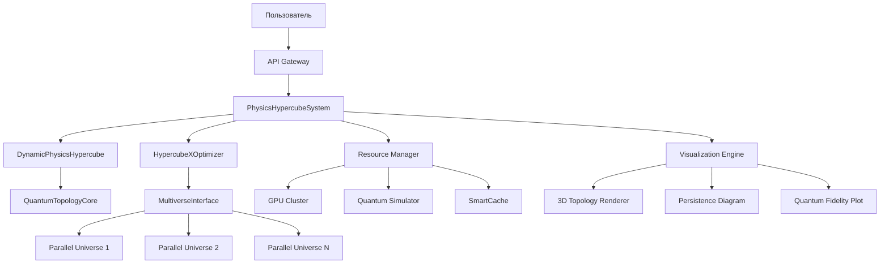

# Архитектура Hypercube-X: Квантово-топологическая система моделирования физических законов


## 🌌 Обзор архитектуры

Hypercube-X реализует **многоуровневую квантово-топологическую архитектуру** с разделением на 7 ключевых слоев:

```
  [Пользовательский интерфейс]
          |
          v
  [API Gateway]
          |
          v
  [Ядро системы] <---> [Квантовый симулятор]
          |
          v
  [Топологический движок] <---> [Мультиверсный контроллер]
          |
          v
  [Вычислительный слой] <---> [GPU/CPU Manager]
          |
          v
  [Хранилище данных] <---> [Кэш-система]
```

## 🔧 Компонентная архитектура


### 1. PhysicsHypercubeSystem (Ядро)
- **Назначение**: Базовый гиперкуб физических законов
- **Компоненты**:
  - Dimension Manager: Управление измерениями (непрерывные/категориальные)
  - Gaussian Process Engine: Моделирование физических законов (классическое/квантовое)
  - Constraint System: Применение философских ограничений
  - Collision Line Detector: Обнаружение коллизионных линий
  - Phase Transition Handler: Обработка фазовых переходов

### 2. DynamicPhysicsHypercube (Динамическое ядро)
- **Назначение**: Расширение с поддержкой эволюции топологии
- **Компоненты**:
  - Topology Evolution Engine: Движок эволюции топологии
  - Holographic Memory: Система голографического сжатия
  - Quantum State Stabilizer: Стабилизатор квантовых состояний
  - Multiverse Interface: Интерфейс для работы с параллельными вселенными

### 3. QuantumTopologyCore (Квантовое ядро)
- **Назначение**: Квантовые вычисления для топологического анализа
- **Компоненты**:
  - Entanglement Circuit Builder: Построение квантовых схем
  - Topological Fidelity Calculator: Расчет топологической верности
  - Quantum State Analyzer: Анализ квантовых состояний
  - Decoherence Monitor: Контроль декогеренции

### 4. HypercubeXOptimizer (Оптимизатор)
- **Назначение**: Оптимизация системы через передовые методы
- **Компоненты**:
  - Dimensionality Reducer: Топологическая редукция размерности
  - Multiverse Explorer: Исследование параллельных вселенных
  - Emergence Detector: Детектор эмерджентных свойств
  - Quantum Optimization Engine: Квантовая оптимизация

### 5. Resource Management (Управление ресурсами)
- **Назначение**: Оптимальное использование вычислительных ресурсов
- **Компоненты**:
  - GPUComputeManager: Динамическое распределение задач CPU/GPU
  - SmartCache: Интеллектуальная система кэширования
  - Quantum Resource Allocator: Управление квантовыми ресурсами
  - Autoscaler: Автомасштабирование вычислительных узлов

### 6. Visualization & Analysis (Визуализация)
- **Назначение**: Научная визуализация и анализ данных
- **Компоненты**:
  - Topology Visualizer: 3D визуализация топологии
  - Persistence Diagram Renderer: Визуализация персистентных гомологий
  - Quantum State Viewer: Анализ квантовых состояний
  - Multiverse Comparator: Сравнение вселенных

### 7. API Gateway
- **Назначение**: Единая точка входа для взаимодействия
- **Компоненты**:
  - RESTful Interface: HTTP API для управления системой
  - Quantum Job Scheduler: Планировщик квантовых задач
  - Authentication Service: Аутентификация и авторизация
  - Request Validator: Валидация научных запросов

## 🌐 Системная архитектура



## 📊 Потоки данных

### 1. Основной цикл моделирования
```
Пользовательский запрос -> 
Инициализация гиперкуба -> 
Добавление экспериментальных данных -> 
Топологический анализ -> 
Квантовая оптимизация -> 
Мультиверсная валидация -> 
Визуализация результатов
```

### 2. Цикл эволюции топологии
```
Обнаружение аномалии -> 
Активация фазового перехода -> 
Пересчет топологических инвариантов -> 
Адаптация размерности -> 
Обновление квантовой схемы -> 
Сохранение в голографическую память
```

### 3. Мультиверсный исследовательский цикл
```
Создание параллельных вселенных -> 
Модификация физических законов -> 
Сравнение топологических инвариантов -> 
Расчет квантовой когерентности -> 
Определение стабильности -> 
Перенос знаний в основную вселенную
```

## 🧪 Научные алгоритмы

### 1. Топологический анализ
```python
def calculate_topological_invariants():
    # 1. Нормализация данных
    X = MinMaxScaler().fit_transform(known_points)
    
    # 2. Вычисление персистентных гомологий
    vr = VietorisRipsPersistence(homology_dimensions=[0,1,2])
    diagrams = vr.fit_transform([X])
    
    # 3. Расчет чисел Бетти
    betti_curves = BettiCurve().fit_transform(diagrams)
    betti_numbers = {dim: np.sum(betti_curves[0][:, dim] > 0.1) for dim in [0,1,2]}
    
    # 4. Обновление состояния системы
    topological_invariants = {
        'persistence_diagrams': diagrams,
        'betti_curves': betti_curves,
        'betti_numbers': betti_numbers
    }
```

### 2. Квантовая оптимизация
```python
def quantum_entanglement_optimization(depth=3):
    # 1. Подготовка данных
    X = topology_aware_normalization(known_points)
    y = minmax_scale(known_values)
    
    # 2. Создание квантовой схемы
    feature_map = EfficientSU2(num_qubits, reps=2)
    ansatz = EfficientSU2(num_qubits, reps=depth)
    quantum_circuit = feature_map.compose(ansatz)
    
    # 3. Инициализация QNN
    qnn = CircuitQNN(circuit=quantum_circuit, ...)
    
    # 4. Обучение с топологической регуляризацией
    vqc = VQC(quantum_instance=Aer.get_backend('qasm_simulator'))
    vqc.fit(X, y, callback=topology_adaptation_callback)
    
    # 5. Перенос квантовых знаний
    transfer_quantum_knowledge(vqc, X, y)
```

### 3. Голографическое сжатие
```python
def compress_to_boundary(ratio=0.8):
    # 1. Расчет критических точек
    find_critical_points()
    
    # 2. Сохранение граничных данных
    boundary_data = {
        'topological_invariants': topological_invariants,
        'critical_points': critical_points,
        'symmetries': symmetries,
        'dimension_ranges': {dim: (min_val, max_val) for dim, (min_val, max_val) in dimensions.items()}
    }
    
    # 3. Частичное удаление внутренних данных
    keep_indices = np.random.choice(len(known_points), int(len(known_points)*ratio))
    self.known_points = [known_points[i] for i in keep_indices]
    self.known_values = [known_values[i] for i in keep_indices]
    
    # 4. Активация флага сжатия
    holographic_compression = True
```

## 🚀 Производительность и масштабируемость

### 1. Ресурсные требования
| Компонент             | CPU         | GPU         | RAM       | Квантовые кубиты |
|-----------------------|-------------|-------------|-----------|------------------|
| Базовый гиперкуб      | 4 ядра      | Не требуется| 8 GB      | -                |
| Топологический анализ | 8 ядер      | NVIDIA V100 | 32 GB     | -                |
| Квантовая оптимизация | 16 ядер     | NVIDIA A100 | 64 GB     | 12-24            |
| Мультиверсное моделир.| Распределен.| Многопроц.  | 128+ GB   | 16-32            |

### 2. Оптимизации производительности
- **Динамическая балансировка нагрузки**: Автоматическое распределение задач между CPU/GPU
- **Квантовое ускорение**: Использование VQC для задач оптимизации
- **Топологическое сжатие**: Уменьшение размерности через UMAP/PCA
- **Голографическое кэширование**: Сохранение только граничных данных
- **Мультиверсный параллелизм**: Одновременное исследование вселенных

## 🔮 Будущие направления развития

1. **Интеграция с реальными квантовыми устройствами**
   - Поддержка IBM Quantum, Rigetti, IonQ
   - Гибридные квантово-классические алгоритмы

2. **Расширение топологического анализа**
   - Персистентные гомологии высших порядков
   - Нейротопологические сети
   - Алгебраические топологические инварианты

3. **Мультиверсная синхронизация**
   - Кросс-универсальные корреляционные функции
   - Голографическая телепортация состояний
   - Квантовая запутанность между вселенными

4. **Экспериментальная интеграция**
   - API для LHC (ЦЕРН)
   - Интерфейс для астрономических обсерваторий
   - Поддержка квантовых сенсоров

5. **Расширенные философские ограничения**
   - Принцип космической цензуры
   - Голографический принцип Буссо
   - Квантовая причинность

## ⚖️ Научная валидация

Система проходит многоуровневую валидацию:

1. **Теоретическая согласованность**
   - Проверка на известных физических моделях (Стандартная модель, ОТО)
   - Анализ предельных случаев

2. **Численная точность**
   - Сравнение с традиционными методами (Монте-Карло, решеточные расчеты)
   - Оценка погрешности восстановления

3. **Топологическая корректность**
   - Верификация инвариантов на эталонных многообразиях
   - Анализ устойчивости к возмущениям

4. **Квантовая верификация**
   - Тестирование на квантовых симуляторах
   - Сравнение с теоретическими предсказаниями КТП

Архитектура Hypercube-X обеспечивает научную строгость, вычислительную эффективность и концептуальную глубину для исследования фундаментальных законов физики в многомерных пространствах параметров.
