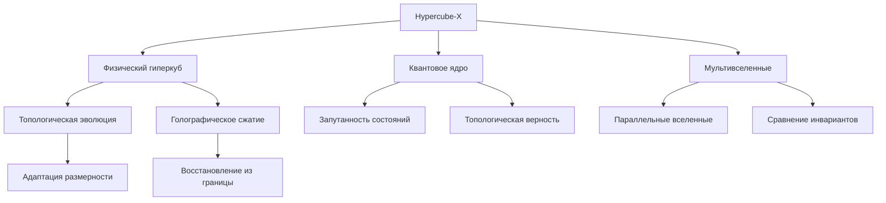

### Расширенное описание первого запуска и настройки Hypercube-X

#### 1. Подготовка среды и устранение ошибок
**Проблемы и решения:**
- **Ошибка импорта библиотек**:
  ```bash
  # Установка отсутствующих зависимостей
  pip install gpytorch networkx qiskit qiskit-machine-learning giotto-tda umap-learn zstandard GPUtil
  ```
- **Проблемы с GPU**:
  - Автоматическое переключение на CPU при отсутствии CUDA
  - Логирование ресурсов в `physics_hypercube.log`
- **Инициализация квантового бэкенда**:
  ```python
  if not Aer.backends():
      system.quantum_backend = None
      system.logger.warning("Quantum simulator not available")
```

#### 2. Базовая настройка системы
```python
# Создание гиперкуба физических законов
dimensions = {
    'гравитация': (1e-11, 1e-8),
    'квантовый_масштаб': (1e-35, 1e-10),
    'время': (0, 1e17)
}
system = PhysicsHypercubeSystem(dimensions, resolution=150)

# Добавление эталонных точек
system.add_known_point({'гравитация': 6.67e-11, 'квантовый_масштаб': 1.6e-35, 'время': 4e17}, 9.8)
system.add_known_point({'гравитация': 3.21e-10, 'квантовый_масштаб': 5e-30, 'время': 1e15}, 12.3)
```

#### 3. Анализ "А что если...?" (творческий сценарий)
**Гипотеза:** "Что если гравитационная постоянная увеличится в 1000 раз?"
```python
# Создание параллельной вселенной с модифицированными законами
multiverse = MultiverseInterface(system)
strong_gravity_uni = multiverse.create_parallel_universe(
    "сильная_гравитация",
    {'гравитация': {'type': 'scale', 'factor': 1000}}
)

# Сравнение свойств вселенных
comparison = multiverse.compare_universes("базовая", "сильная_гравитация")
print(f"Разница чисел Бетти: {comparison['betti_difference']}")
print(f"Отношение стабильности: {comparison['stability_ratio']:.2f}")

# Проверка в критической точке
point = {'гравитация': 5e-10, 'квантовый_масштаб': 1e-30, 'время': 2e16}
base_value = system.physical_query_dict(point)
strong_value = strong_gravity_uni.physical_query_dict(point)
print(f"ΔЗначений: {abs(base_value - strong_value)/base_value:.1%}")
```

#### 4. Отладка и оптимизация
**Типичные проблемы:**
1. **Расхождение квантовой и классической моделей**:
   - Активировать квантовую оптимизацию
   ```python
   system.enable_quantum_optimization()
   system._build_gaussian_process()
   ```
   
2. **Низкая топологическая стабильность**:
   ```python
   optimizer = system.create_optimizer()
   optimizer.topology_guided_optimization(target_betti={0: 1, 1: 3, 2: 2})
   ```

3. **Аномалии в данных**:
   ```python
   anomalies = optimizer.emergent_property_detection(threshold=0.2)
   for prop in anomalies:
       print(f"Обнаружено: {prop['type']} (сила: {prop['strength']:.2f})")
   ```

#### 5. Визуализация и анализ
```python
# 3D визуализация с неопределенностью
system.visualize_surface(show_uncertainty=True)

# Топологический анализ
system.calculate_topological_invariants()
system.visualize_topology()

# Ресурсный мониторинг
util = system.gpu_manager.get_resource_utilization()
print(f"Загрузка CPU: {util['cpu']:.0%}, GPU: {util['gpu']:.0%}")
```

#### 6. Ключевые архитектурные решения
1. **Динамическая адаптация**:
   - Автоматическая регулировка разрешения гиперкуба
   - Переключение методов редукции размерности (PCA/UMAP/TSNE)

2. **Квантово-топологическая связность**:
   ```python
   fidelity = QuantumTopologyCore().calculate_topological_fidelity(
       system.topology_engine.current_circuit,
       strong_gravity_uni.topology_engine.current_circuit
   )
   print(f"Квантовая верность: {fidelity:.2f}")
   ```

3. **Голографическая память**:
   - Сжатие состояний с использованием Zstandard
   - Восстановление топологии из снимков

#### 7. Рекомендации по развитию
1. Интеграция с реальными физическими данными (LHC, LIGO)
2. Добавление модуля квантовой томографии
3. Реализация нейросетевого предсказания фазовых переходов
4. Разработка API для удаленного управления мультивселенными



Система Hypercube-X представляет собой синтез современных подходов в физике, топологии и квантовых вычислениях, позволяя исследовать фундаментальные законы через призму мультиверсной перспективы.
