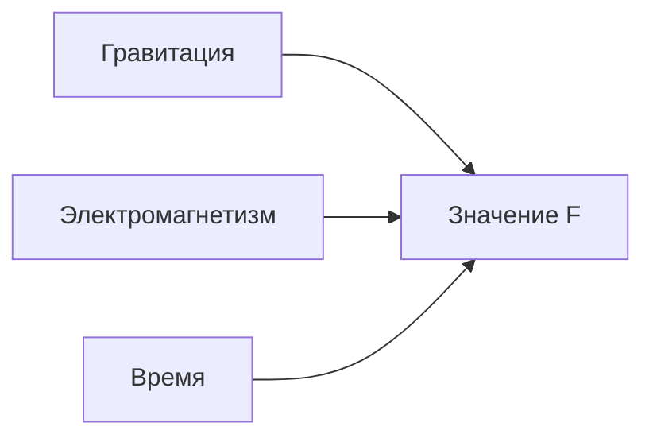
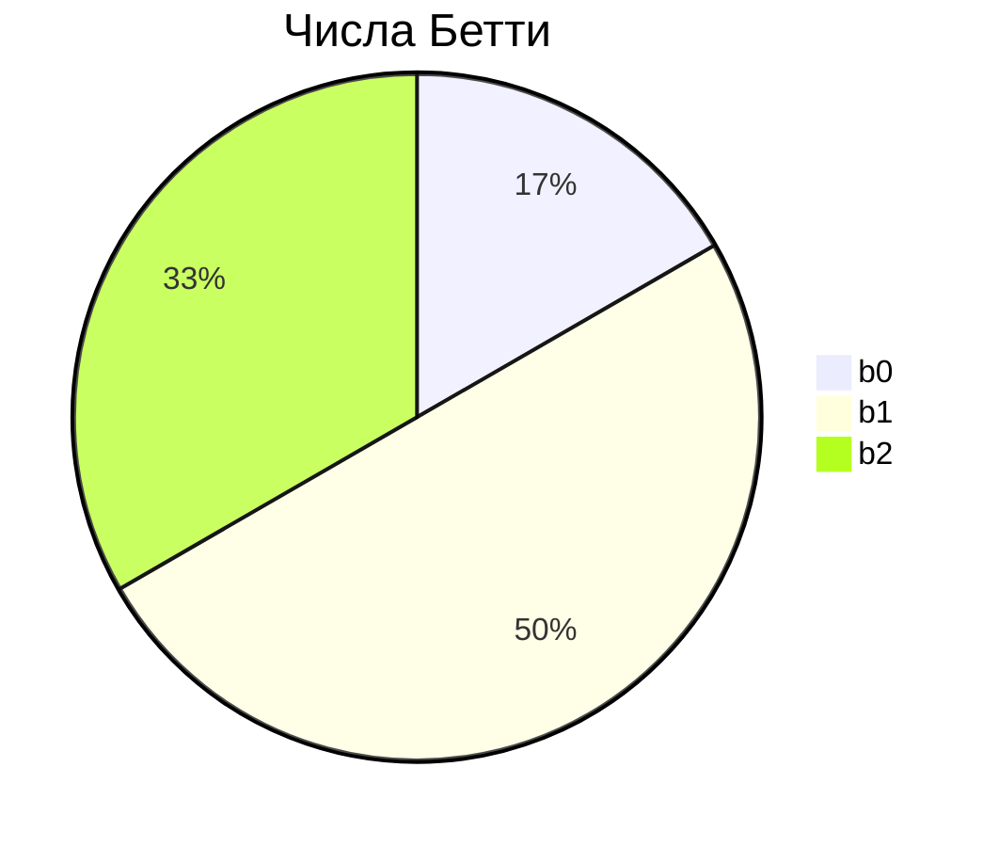

# Теория гиперкубов в Physics Hypercube System (PHCS) v.3.0

## 🌌 Концептуальная основа

Теория гиперкубов в PHCS - это **фундаментальный подход к моделированию физических законов**, основанный на представлении физических систем как многомерных объектов. Основные принципы:

1. **Многомерность физических законов**:

   
   - Каждый физический параметр (гравитация, время, заряд) - отдельное измерение
   - Физический закон - функция в этом n-мерном пространстве
   - Пример: F(g, m1, m2, r) = g·m1·m2/r²

3. **Топологическая инвариантность**:
   - Физические законы сохраняют свойства при деформациях пространства
   - Ключевые инварианты: числа Бетти, эйлерова характеристика

4. **Голографический принцип**:
   - Вся информация о системе содержится на ее границе
   - Возможность реконструкции по граничным данным

## 🧮 Математический аппарат

### 1. Представление гиперкуба
Гиперкуб H определяется как:
$$H = \prod_{i=1}^{n} D_i$$
где:
- $D_i$ - область определения i-го измерения
- $n$ - размерность пространства

### 2. Физический закон
Функция, отображающая точку в гиперкубе в физическое значение:
$$F: H \rightarrow \mathbb{R}$$

### 3. Топологические инварианты
**Числа Бетти**:
$$b_k = \text{ранг } H_k(H)$$
где $H_k$ - k-я группа гомологий

**Эйлерова характеристика**:
$$\chi = \sum_{k=0}^{n} (-1)^k b_k$$

### 4. Критические точки
Точки, где градиент функции обращается в ноль:
$$\nabla F(\mathbf{p}_c) = \mathbf{0}$$

## 🔬 Физическая интерпретация

### 1. Коллизионные линии
Кривые в гиперкубе, вдоль которых физический закон ведет себя аналитически:
$$L(t) = \mathbf{p}_0 + t \cdot \mathbf{v}, \quad t \in [0,1]$$

**Свойства**:
- Линейная интерполяция значений
- Низкая неопределенность
- Физический аналог: "траектории" в пространстве параметров

### 2. Фазовые переходы
Определяются через **неаналитическое поведение**:
$$\lim_{\mathbf{p} \to \mathbf{p}_c} F(\mathbf{p}) \neq F(\mathbf{p}_c)$$

**Типы переходов**:
- Первого рода: скачкообразное изменение
- Второго рода: разрыв производных

### 3. Голографическое сжатие
**Принцип**:
$$I_{\text{объем}} \approx I_{\text{граница}}$$

**Реализация**:
1. Вычисление топологических инвариантов
2. Идентификация критических точек
3. Сжатие до набора граничных данных

## ⚛️ Квантовая интеграция

### 1. Квантовое представление
Состояние гиперкуба описывается волновой функцией:
$$|\psi\rangle = \sum c_i |H_i\rangle$$

### 2. Квантовая запутанность
Корреляция между измерениями:
$$\langle \psi | \sigma_z^i \sigma_z^j | \psi \rangle \neq \langle \psi | \sigma_z^i | \psi \rangle \langle \psi | \sigma_z^j | \psi \rangle$$

### 3. Квантовая оптимизация
Использование VQC (Variational Quantum Classifier):
$$\min_{\theta} \langle \psi(\theta) | H | \psi(\theta) \rangle$$

## 📐 Философские ограничения

### 1. Каузальность
Запрет нефизических зависимостей:
$$\forall t_i < t_j: \frac{\partial F}{\partial t_j} \not\to \infty$$

### 2. Детерминизм
Однозначность предсказаний:
$$d(\mathbf{p}_1, \mathbf{p}_2) < \epsilon \Rightarrow |F(\mathbf{p}_1) - F(\mathbf{p}_2)| < \delta$$

### 3. Голографичность
Согласованность с граничными данными:
$$|F_{\text{внутр}} - F_{\text{гран}}| < \eta$$

## 🌟 Эмерджентные свойства

### 1. Классификация
| Тип свойства | Математический критерий |
|--------------|--------------------------|
| Нелинейные взаимодействия | $\nabla^2 F > \theta$ |
| Квантовая когерентность | $\langle \psi | H | \psi \rangle < E_{\text{класс}}$ |
| Фазовые переходы | $\frac{\partial F}{\partial T} \to \infty$ |

### 2. Детектирование
1. Анализ энтропии:
   $$S = -\sum p_i \ln p_i$$
2. Кластеризация критических точек
3. Измерение квантовой запутанности

## 🌀 Мультиверсумная теория


### 1. Параллельные гиперкубы
Набор гиперкубов с различными параметрами:
$$\mathcal{M} = \{H_u\}_{u=1}^{N}$$

### 2. Межвселенские корреляции
Корреляционная функция:
$$C_{uv} = \frac{\langle F_u F_v \rangle - \langle F_u \rangle \langle F_v \rangle}{\sigma_u \sigma_v}$$

## 💡 Практические приложения

### 1. Моделирование новых физических систем
```python
# Создание гиперкуба для экзотической материи
dimensions = {
    'dark_energy_density': (0, 1e-26),
    'quantum_spin': [0.5, 1.5, 2.5],
    'chronal_parameter': (-1, 1)
}
system = PhysicsHypercubeSystem(dimensions)
```

### 2. Предсказание неизвестных законов
Аналитическое продолжение в неизученные области параметров:
$$F_{\text{экстр}} = \lim_{\mathbf{p} \to \partial H} F(\mathbf{p})$$

### 3. Верификация теорий
Сравнение предсказаний различных физических моделей:
$$\Delta = \int_H |F_{\text{теор}} - F_{\text{эксп}}|  dH$$

## 📊 Визуализация теории

### 3D-проекция гиперкуба




### Топологическая диаграмма


Теория гиперкубов в PHCS обеспечивает универсальный математический аппарат для моделирования физических систем любой сложности, объединяя достижения дифференциальной геометрии, топологии и квантовой теории поля.
